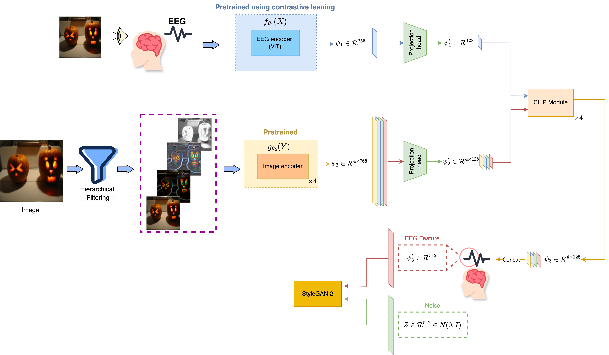

# HierarchicalCLIP-ViT: EEG-Based Image Reconstruction

## Overview
HierarchicalCLIP-ViT is a novel framework designed for reconstructing visual stimuli from EEG signals using a combination of transformer-based EEG processing and hierarchical visual feature extraction. This method enhances the quality and accuracy of image generation compared to traditional approaches.


## Methodology
### 1. Transformer-Based EEG Processing
We utilize a Vision Transformer (ViT) to process EEG data, capturing spatiotemporal features that better represent brain activity during visual stimuli. The transformer model outperforms traditional LSTM and CNN methods in long-range dependency modeling, essential for EEG analysis.

### 2. Hierarchical Feature Extraction
Inspired by the hierarchical nature of human vision, the model progressively extracts complex visual features—edges, textures, shapes—aligning them with EEG features in a joint latent space. This alignment improves biological plausibility in the image reconstruction process.

## Image Generation
A StyleGAN is used to generate high-resolution images from the aligned EEG and image features, ensuring realistic reconstructions.

### Evaluation Metrics
We evaluate our model with:
- **Inception Score (IS)**
- **Fréchet Inception Distance (FID)**
- **Multivariate Analysis of Variance (MANOVA)**
These metrics show significant improvement over prior methods on datasets like **EEGCVPR40** and **ThoughtViz**.



## Getting Started

1. Clone the repository:
   ```bash
   git clone https://github.com/EEG-Vision/EEG-Vision.git

2. Install dependencies:
   ```bash
   pip install -r requirements.txt

## Datasets
- **EEGCVPR40**
- **ThoughtViz**

## Results
Our model achieves state-of-the-art results on both datasets, with significant improvements in IS and FID metrics compared to previous approaches. See the full evaluation results in the results/ folder.

## Conclusion
HierarchicalCLIP-ViT advances EEG-based image reconstruction, combining transformer models and hierarchical feature extraction to significantly improve the quality of generated images.
